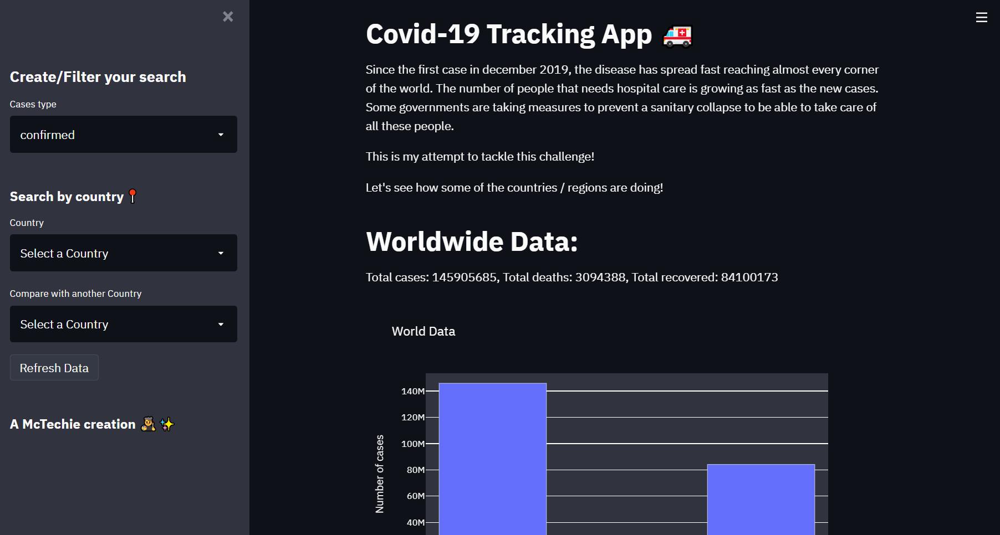

# Covid-19 Tracking App 🚑

> A McTechie creation 👨‍🎨✨

> This application has been created in a workshop conducted by CSI-VESIT in collaboration with **[AI Probably](https://aiprobably.com/)**.

### Tech Used

- [x] Python (3.9.1)
- [x] Streamlit (0.80.0)
- [x] APIs (Covid-19 API)
- [x] Heroku

> The [Coronavirus COVID19 API](https://documenter.getpostman.com/view/10808728/SzS8rjbc?version=latest#81447902-b68a-4e79-9df9-1b371905e9fa) is used to get the data in this app.

---

### Main Page

